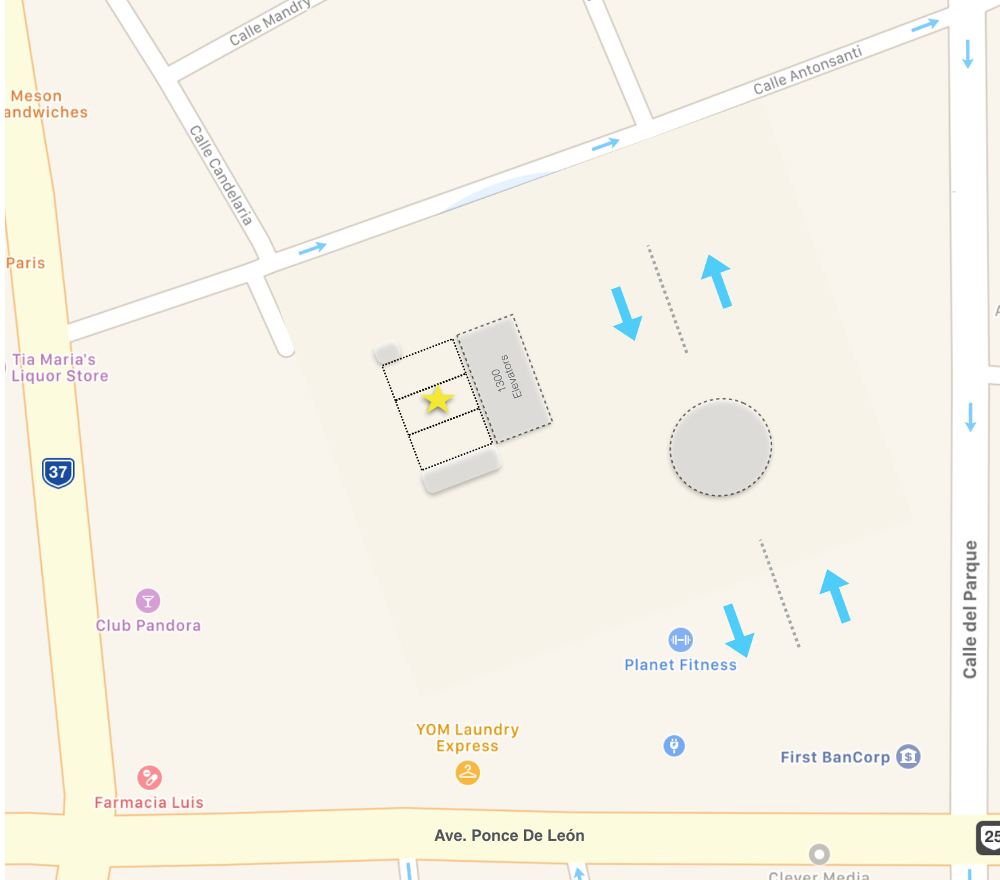

Facilities
==========

Postal Address
--------------

Parking
-------

A single parking spot for this unit is located on level ``S1`` right behind the
elevator bay for tower 1300. The spot is labeled with number ``21094``.

Trash
-----

Regular trash is collected in the service room located right on the 6th floor.
Please make sure to close the lid of the gray garbage bin to avoid issues with
smells and bugs.

Recycling
---------

Ciudadela has a single stream recycling program. Paper, cardboard, plastic, cans
and bottles are collected in the recycling room next to the main entrance door
on ``Plaza`` level.

Plastic Bag Free Environment
----------------------------

Puerto Rico no longer allows the use of plastic bags. You will need to bring
your own reusable bags when shopping at the grocery store ``Pueblo``. For your
convenience, there is a reusable basket in the kitchen pantry.

