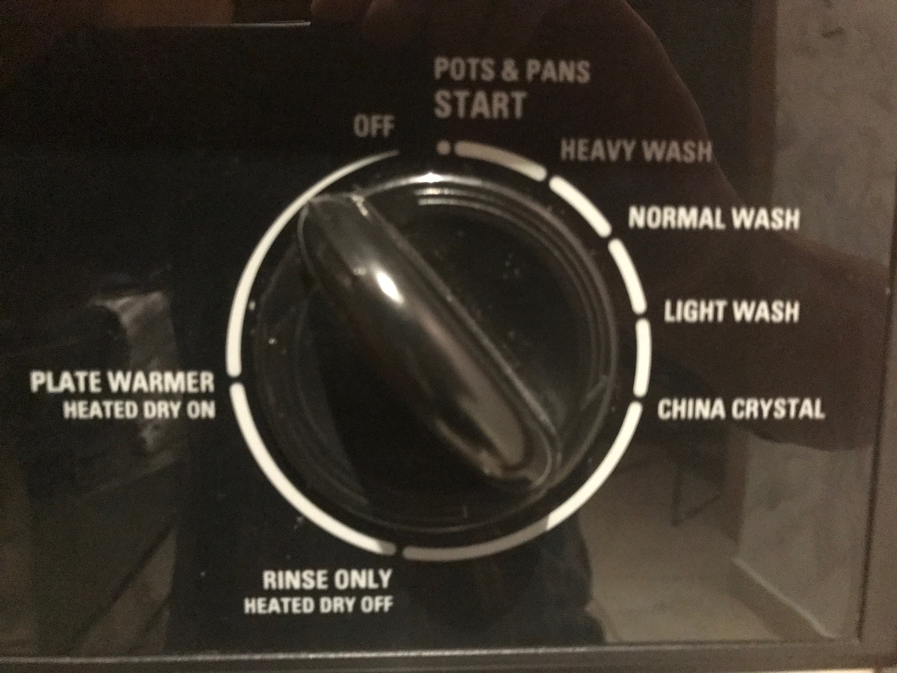

Kitchen
=======

Dry off water and ice dispenser
-------------------------------

If the floor is getting wet right in front of the fridge's door, it is a good
indication that the shallow trap right under the water and ice dispenser needs
to be dried off. Lift the plastic grate and use a towel or paper towel soak the
water.

How to drain the dishwasher?
----------------------------

The dishwasher can collect water at the bottom if it does not fully finishes a
cycle or it there is an obstruction in the sink's drain. The picture below shows
the position of the knob to force a drain cycle.

