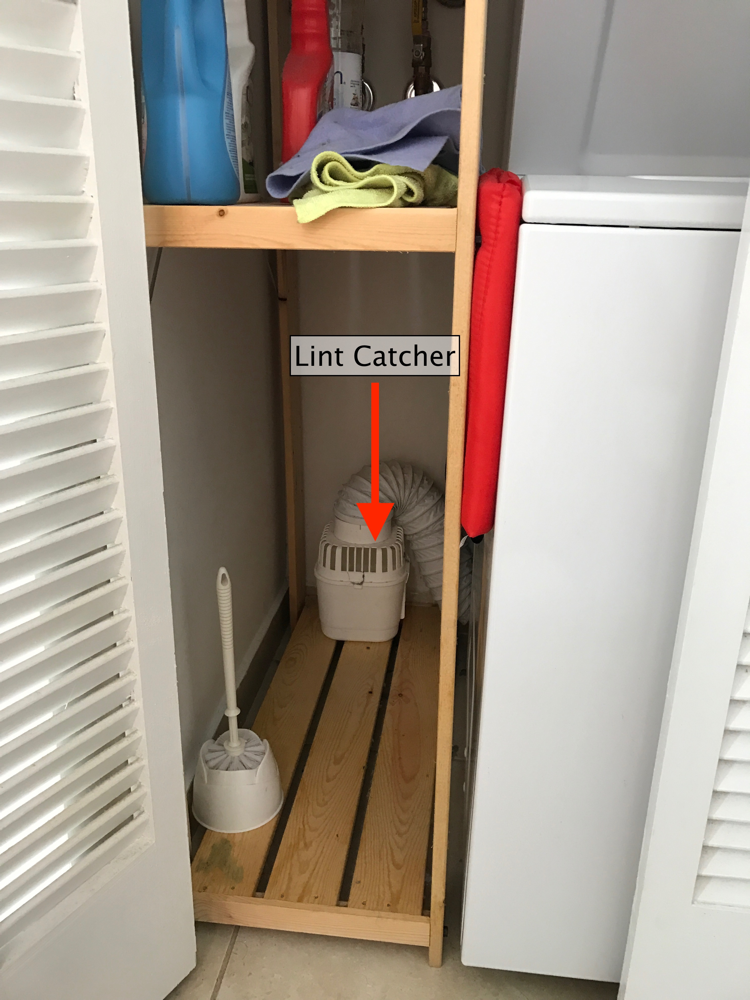
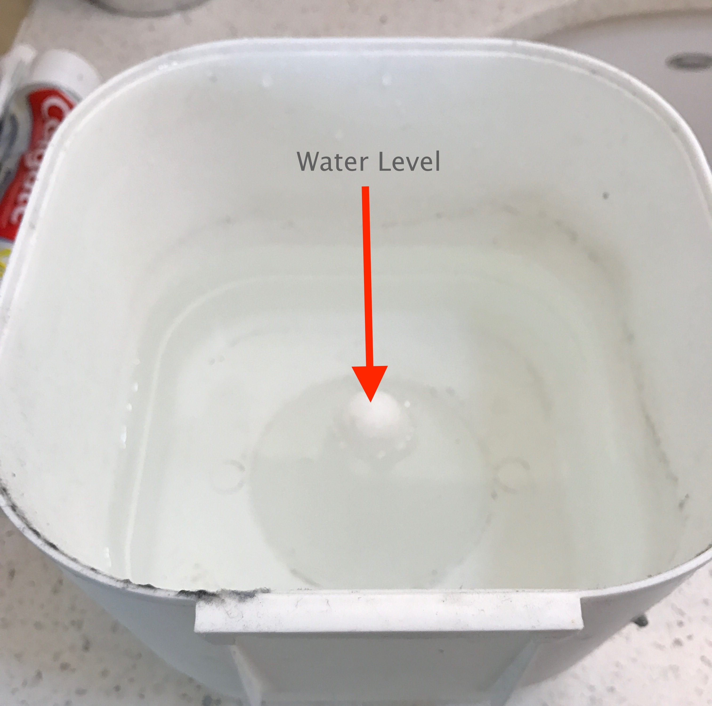
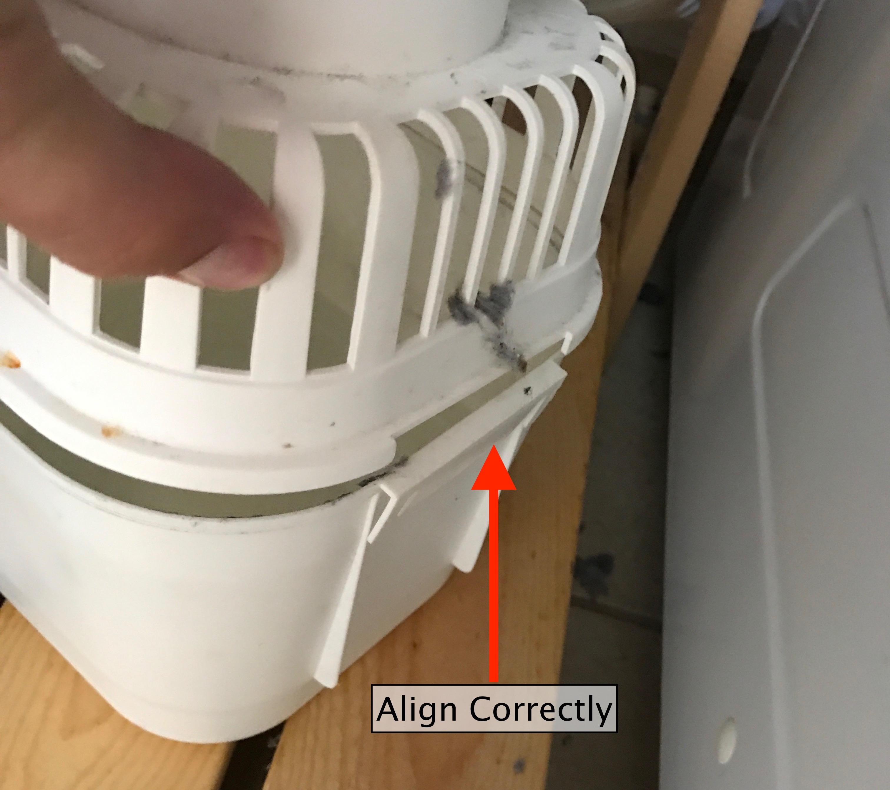

Laundry
=======

The dryer in these apartments **do not** have an exhaust line that leads outside
the building. Instead, the dryer exhaust hose is connected to a lint catching
system that uses water to trap lint. It is **very important** to clean the lint
screen and lint catcher system are maintained regularly.

Cleaning the lint off the dryer
-------------------------------

The lint screen can be found inside the dryer at the bottom of the door opening.
Just lift out, remove lint and place back into the dryer. Clean the lint screen
after each drying cycle.

TODO: Photo

Refilling the lint catcher with water
-------------------------------------

The exhaust of the dryer is connected to a hose that ends in a white canister
that is filled with water to catch lint. At least once a week, the canister
should be filled back with water in order for the system to work. The canister
is sitting towards the back of the bottom shelf next to the washer & dryer.

To refill with water:

1. Detach the top part of the canister.

2. Fill with water to the top of the center cone

3. Replace the lid. Make sure that the lid and canister are correctly aligned

4. Push canister towards the back wall, but make sure it remains on the shelf
